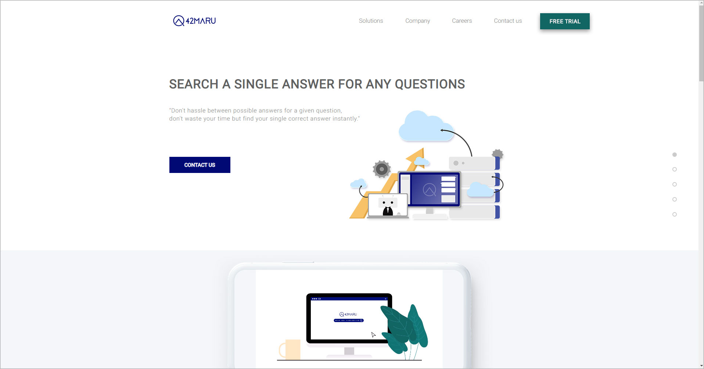
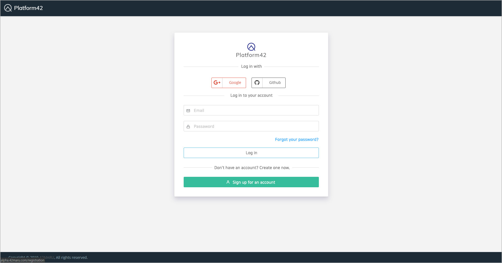
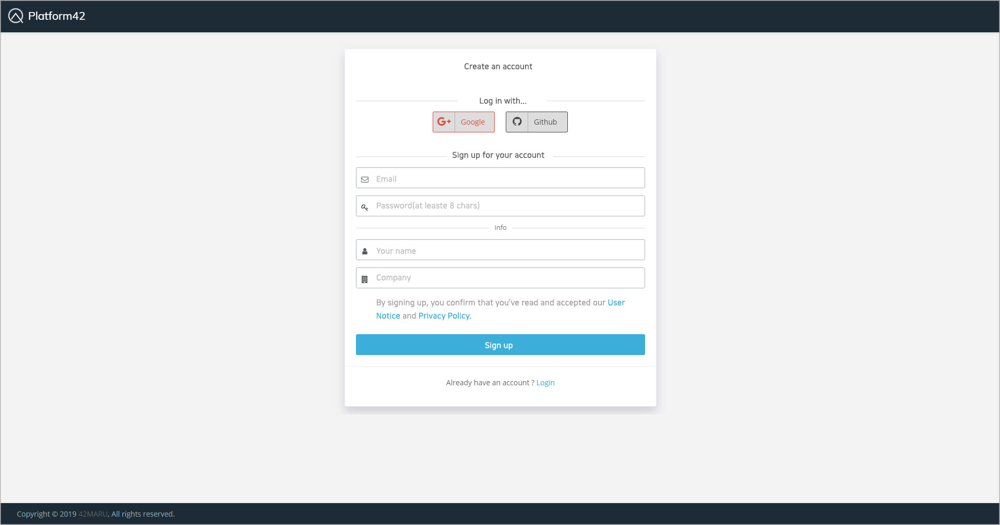
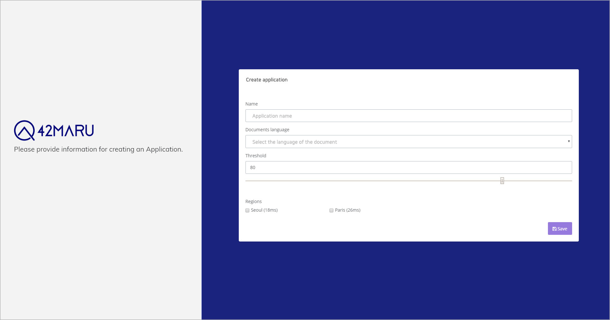
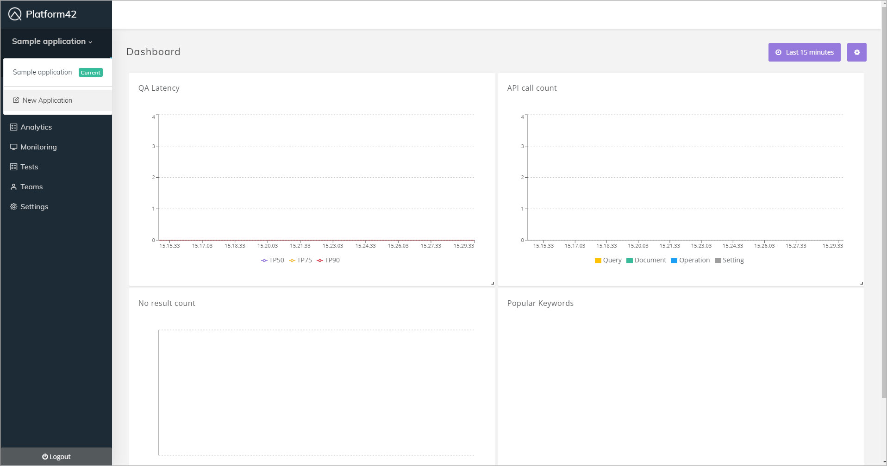
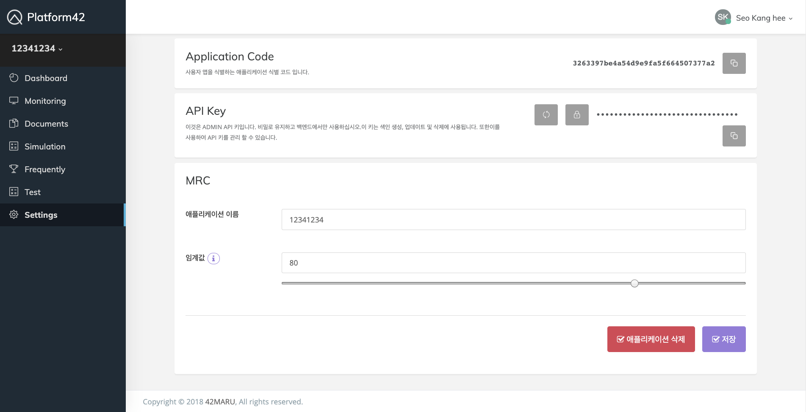

# Getting Started

## Required

${platform} 의 검색 서비스를 이용하기 위해서는 계정과 app을 생성해야 합니다.

홈페이지의 우측 상단에 위치한 \[FREE TRIAL\]을 클릭하면 PLATFORM 42 서비스의 'Login' 페이지로 이동합니다. 



### Step 1 : Sign Up

회원가입이 필요하다면 'Login'페이지 하단에 위치한 \[Sign up for an account\]를 클릭해 'Create an account' 페이지로 이동하여 계정을 생성합니다.





### Step 2 : Create an Application

#### 계정 생성 

최초로 계정 정보를 등록한 후 접하게 되는 'Create application' 화면에서 새로운 app을 생성할 수 있습니다. 



* Name : app 이름을 설정합니다.
* Documents language : 검색 대상이 되는 문서의 언어를 설정합니다. app은 이곳에서 설정한 언어를 앞으로 들어올 documents와 질문의 언어로 인지합니다. 현재까지 Korean, English, Deutsch 총 3개의 언어를 지원하며 한 개의 app에 한 개의 언어를 선택할 수 있습니다. app 생성 시에만 Document language 선택이 가능하고 app 생성 후에는 이 설정을 변경할 수 없습니다. 해당 설정에서 변경이 필요하면 새로운 app을 생성해야 합니다.
* Threshold : 검색엔진이 선출한 결과가 정답에 가까운 정도에 따라 답변으로 노출시킬지 여부를 결정하는 기준값입니다. Threshold을 너무 낮게 설정하면 답이 없을만한 질문에 대해서 정답을 찾아내어 반환할 가능성이 높습니다. 반면, Threshold가 너무 높으면 정답을 판단하는 기준이 엄격해져서 많은 질문에 대해서 정답으로 판단할 가능성이 높습니다. 따라서, Test를 거쳐 적절한 Threshold를 설정하기를 권장드립니다.
* Regions : 서버를 생성할 위치를 설정합니다. 실제 서비스가 나가는 지역과 가까운 지역을 선택합니다. 애플리케이션의 데이터를 여러 Region의 서버에 저장할 수 있습니다. 모든 API 요청은 빠른 응답속도를 가지는 서버로 라우팅 됩니다.


사용자는 다양한 설정값과 데이터로 만들어진 여러 개의 app을 동시에 운영할 수 있습니다. ${Platform}의 계정관리 기능을 제외한 모든 기능들은 app 단위로 구분됩니다. app은 서로 독립적이며 한 app의 변화가 다른 app에 영향을 주지 않습니다.


#### 애플리케이션 추가 생성

app을 추가하고 싶다면 다음의 단계를 통해 쉽게 생성할 수 있습니다.

1. 메뉴 네비게이션 바의 상단에서 \[현재 app\]을 클릭합니다.
2. 드롭다운 메뉴 내  \[New Application\]를 클릭하면 'Create application' 페이지로 전환됩니다.
3. 'Create application' 페이지에서 주어진 항목을 모두 설정하고 \[Save\]를 클릭하면 애플리케이션이 생성됩니다.



### Step 3 : Authentication

app을 생성하게 되면 ${platform}의 기능 대부분을 사용할 수 있습니다. API와 SDK를 사용할 때는 app의 Application Code 값과 API Key 값이 필요합니다.

**Application Code 값, API Key 값 확인**

 이 값들은 화면 좌측 메뉴 네비게이션 바 하단에 위치한 'Settings' 메뉴에 들어가서 확인할 수 있습니다.



* Application information: 애플리케이션 정보를 확인, 변경, 삭제할 수 있습니다.
* Application code: API를 사용할 때 애플리케이션을 식별하는 데 사용되는 키 값을 확인할 수 있습니다.
* API Key: Admin API, Monitoring API, Search QA API를 호출할 때 필요한 키 값을 확인, 변경할 수 있습니다. 
* IP Blacklist: 모든 API에 접근 금지가 필요한 IP를 등록, 수정, 삭제할 수 있습니다. 
* Regions: 애플리케이션의 데이터를 저장할 서버의 위치를 확인, 변경할 수 있습니다.  


### Step 4 : Dashboard

대쉬보드를 확인하는 과정을 보여줄

## Optional : Installation SDK

### Python

```text
$ pip install ~~~
```

## Next Steps

계정 및 app이 생성 되었다면 ${platform} 의 기능들을 정삭적으로 이용하실 수 있습니다.

### Search Services



### Features















### Additional Resources











