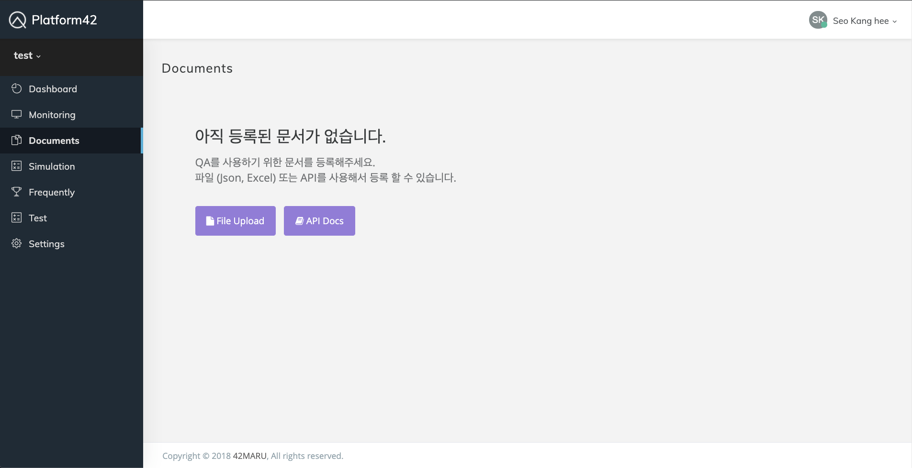

# Upload passage

## Browser

문서 추가는 Documents 화면에서 가능합니다.



그 다음 File Upload 버튼을 클릭 하시면 새로운 창이 팝업되며 이곳에서 드래그 앤 드롭으로 파일을 업로드 하실 수 있습니다.


json, excel 형식의 파일을 지원합니다.





Upload a passage



 하나의 문서를 업로드 한다.






app의 id



app의 접근권한을 가진 key










```yaml
{
    "data": {
        "id": 3044702,
        "doc_id": 337842,
        "application_id": 24,
        "title": "제한 효소",
        "content": "몇 종류의 제한 효소를 이용하여 목표 DNA 와 반응을 시키면, 각각의 제한 효소가 특정한 염기서열 을 인식해 DNA 를 절단하므로, 특정한 제한 효소 작용자리가 상대적으로 어느 위치인지 알 수 있다. 이를 이용하여 유전자 지도를 작성한다.",
        "deleted": false,
        "created_at": "2019-08-07T02:27:54",
        "updated_at": null
    }
}
```







```

```





Body parameters


content는 필수정보 입니다.


```yaml
{
    "doc_id": 337842,
    "title": "제한 효소",
    "content": "몇 종류의 제한 효소를 이용하여 목표 DNA 와 반응을 시키면, 각각의 제한 효소가 특정한 염기서열 을 인식해 DNA 를 절단하므로, 특정한 제한 효소 작용자리가 상대적으로 어느 위치인지 알 수 있다. 이를 이용하여 유전자 지도를 작성한다."
}
```



Upload many passages



 여러개의 문서를 업로드 한다.






app의 ID



app 의 접근권한을 가진 Key










```yaml
{
    "data": {}
}
```







```

```





Body Parameters


content는 필수정보 입니다.


```yaml
[
    {
        "doc_id": 337842,
        "title": "제한 효소",
        "content": "몇 종류의 제한 효소를 이용하여 목표 DNA 와 반응을 시키면, 각각의 제한 효소가 특정한 염기서열 을 인식해 DNA 를 절단하므로, 특정한 제한 효소 작용자리가 상대적으로 어느 위치인지 알 수 있다. 이를 이용하여 유전자 지도를 작성한다."
    },
    {
        "doc_id": 337842,
        "title": "제한 효소",
        "content": "사람의 DNA 중 유용한 물질을 생산하는 부분을 제한 효소로 절단하여 조각을 대장균 의 플라스미드 DNA 에 연결한다. 형질전환 된 플라스미드를 대장균 에 삽입하여, 짧은 시간에 유용한 물질을 대량 생산한다."
    },
    {
        "doc_id": 1758246,
        "title": "윤정일 (배우)",
        "content": "--중앙대학교 연극학과\r\n"
    },
    {
        "doc_id": 1758246,
        "title": "윤정일 (배우)",
        "content": "--《 심장박동조작극 》 (2017년) - 승빈 역\r\n--《 양치기들 》 (2016년) - 영민 역\r\n--《 동주 》 (2016년) - 조선유학생 2 역\r\n"
    }
]
```

